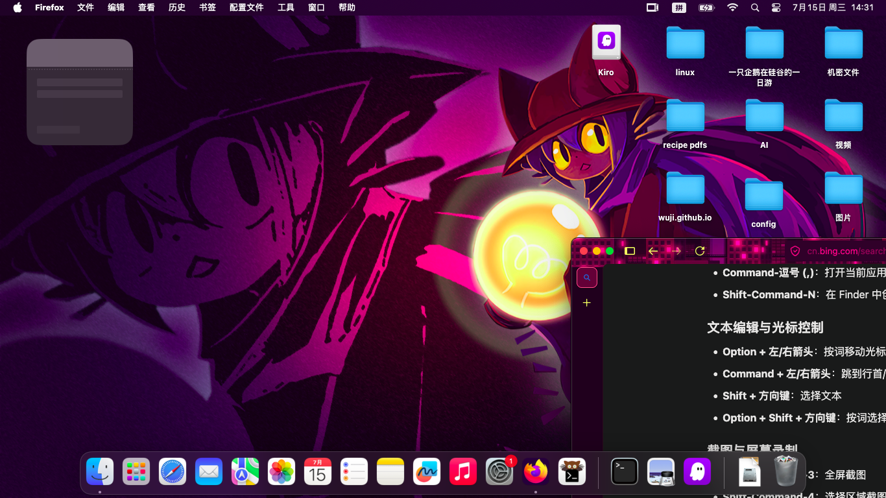

# 个人博客

这里收录我写的东西。

## wj1	hello,world

这是一个开始

## wj2  github clone 加速

在平日里在github上看到好玩的项目想clone下来却发现clone速度慢到离谱！

有时甚至只有几十KB每秒这样的速度很容易把我们给气死.

我来帮你解决这个问题.

其实十分简单只需要配置全局替换规则,就像这样.

```bash
git config --global url."填一个镜像站".insteadOf "https://github.com/"
```

哪镜像站该如何获取呢?我推荐几个.

### gh-proxy.org(富哥可以给这位活佛捐点https://gh-proxy.com/donate/)

```
git config --global url."https://gh-proxy.org/https://github.com/".insteadOf "https://github.com/"
```

### Fastly CDN

```
git config --global url."https://cdn.gh-proxy.org/https://github.com/".insteadOf "https://github.com/"
```

### **(链接🔗来源：https://gh-proxy.com/  活佛🐮🍺好用)**

### 注意事项(别人站长给出的注意事项!)

### 本服务仅供学习研究使用

* 请勿滥用，否则可能会被限制访问
* 如果遇到问题，请检查链接格式是否正确
* 建议收藏本站，以便日后使用
* 转换工具会自动更新，无需手动升级
* 选择最适合您网络环境的区域节点

## 免费域名

[](https://dash.domain.digitalplat.org/signup?ref=IP47Bkcu1M)

这是一个免费域名的项目当然它不是我的注册它需要github账号
你也可以使用我的邀请链接来注册
https://dash.domain.digitalplat.org/signup?ref=IP47Bkcu1M

## wj3 ”oneshot“

简约的桌面可以提高人的工作效率，我想是这么一回事。但niko太可爱了所以我把桌面换掉了!

简约是什么？瞥了，好看才是这台电脑一辈子的事。还有好多东西可以改有点肝。

## wj4 从折腾到折腾

2026年7月13日我出现了一个不成熟的想法那就是抛弃原有的nixos去黑苹果也就是macOS，我花了半天时间去思考和左右脑互博，我发现这想法很棒，很棒！

那我成功了吗？肯定成功了不然我也不可能写下这篇博客，以我的脑瘫性格一抛弃就直接是抹盘安装新系统（macOS）然后就开始折腾的毕竟以前没有碰过黑苹果这东西自然对着玩意也是“**刘姥姥进大观园——洋相百出**”比如忘记删除别人efi仓库里重叠的驱动文件，将错误的EFI文件夹装入u盘就这样一搞就是三十多个小时（肯定不是连续弄的毕竟要睡觉）就是这些破事困住我这种沙子三十多个小时我差点急的准备啃显示屏。但最后还是安上用上了。

过程简述完了我讲一下一些我个人认为比较牛逼的地方：

1.我的这张无线网卡在win10和nixos最高只有15MB/s但在macOS上竟然跑出了40MB/s的最高速度，这可能是macOS真的牛逼也可能是我一土鳖没有见过好东西（以上说的是我在curl还有家中的gitea矿渣服务器上的下载与仓库克隆速度还有macOS的网卡驱动方案我用的是**AirportItlwm，网络速度可能会受环境与硬件的影响所以我说的那些只是我看到的并不具备参考价值）
感谢那个在 macOS 里碰了一鼻子灰的自己以及我的耐心对了。对了还有开源社区与黑苹果社区无私奉献的开发者们是因为他们的奉献才使你我用如此简单的流程可以用上黑苹果（虽说三十多个小时也不短了）**

以下展示我的macOS桌面（依旧oneshot）

我现在正在这台机器上敲这篇博客，我认为我应该叫它“think Mac”，等哪天它不想叫了，我再改回去。

> 更多文章持续更新中...
